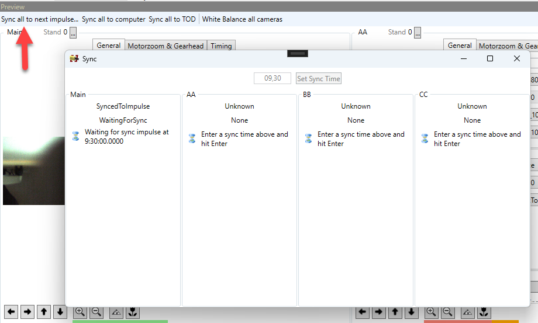

# Troubleshooting

## Frozen image

In case a camera is showing a frozen frame and not live image anymore, check the following:

Go to the camera's website and see if there is no frame visible at all. If it is not frozen there, you may ned to reconnect the camera in the TimedVideoSystem software. The frames should start appearing again.&#x20;

If the frame is also frozen or missing on the camera's website, you can upload debug information to ALGE for further investigation. But for this to work the camera needs to have access to internet upfront, so a correct gateway and DNS serve must be set. If this is the case, you can upload debug information wit this button:&#x20;

<figure><figcaption></figcaption></figure>
